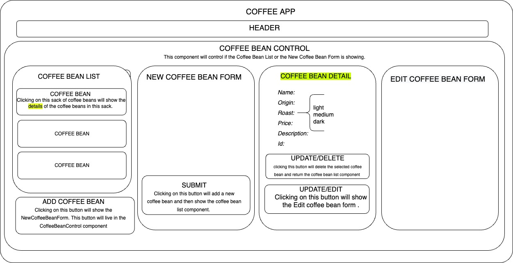

# Latte Larry's Coffee

## By Caroline Cerussi

# Description:

An inventory tracker for Larry's coffee bean business. You can see a list of coffee bean types and click each type to see more information about it. You can sell coffee bean bags that may be broken up for a partial purchase, and see a difference in the coffee bean weight after beans are sold. It is also possible to create a new coffee bean type form where you can input any information such as name, origin, roast etc.

# Technologies Used: 

* Node
* JavaScript
* CSS
* React
* Bootstrap
* Babel
* Es-Linter

# Diagram 

# Setup & Installation Requirements

* Clone this repository from https://github.com/carolinecerussi/Latte-Larrys.git to your desktop
* Navigate to the top level of the directory
* In your terminal console: $cd to coffeebean
* $npm install
* $npm run start

# Known Bugs
* Method to correctly decrease the coffee bean weight is not completely functional.

# License 
copyright (c) 9-9-2022 Caroline Cerussi